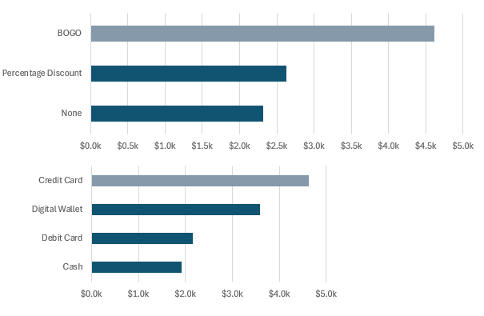

# Walmart Consumer Behavior Dashboard

## Introduction
This Walmart Consumer Behavior Excel dashboard was developed to find how loyalty systems, discounts and payment methods affect the overall expenditure. 

This dataset, available on Kaggle at https://www.kaggle.com/datasets/ankitrajmishra/walmart, contains a small sample of transactions from Walmart stores across five U.S. cities. It features a range of variables, such as inventory levels, demand forecasting, and weather conditions on the transaction days.

## Key questions
This dashboard seeks to answer the following questions surrounding consumer behavior patterns in Walmart:

- ¿What´s the effect of loyalty programs on consumer expenditure?¿Do higher loyalty levels increase consumer expenditure?

- ¿What´s the most effective discount type for each consumer loyalty level?

- ¿Are payment methods related to certain loyalty levels?

## Methodology

This dashboard was built in two steps.

**Step 1: Database Exploration**  
The first step involved exploring the database. The goal was to understand how the groups of key variables (loyalty level, cities, discount types, and payment methods) were balanced and to assess if the presence of undersampling could affect the interpretation of total spending on purchases (simple counts). Additionally, we aimed to determine if the distribution of spending per transaction suggested that the mean or median would be more appropriate for analysis (histogram).

**Two notes:**
- This initial analysis can be found in an Excel file within the *Data_Exploration* folder. 
- It is important to note that this exercise does not use or demonstrate causal or predictive interpretation methodologies. Therefore, the insights derived are purely descriptive of the analyzed sample.

**Step 2: Excel Tools Implementation for Dashboard**  
The second step was to implement the following Excel tools to present the data in a dashboard format:

- Application of **formulas** such as `XLOOKUP`, `SUMPRODUCT`, `IF`, `MEDIAN`, and `UNIQUE`.
- **Dynamic arrays** for data visualization using bar charts, maps, and other graph types.
- Inclusion of **filters and validations** to enhance user interaction.

Since this first exercise was not focused on modifying the original dataset, no missing values or complex data typologies were introduced.

## Graphs

### Loyalty Level Expenditure - Bar Chart  
This bar chart shows median expenditure by loyalty level.

### Discount Type and Payment Method Expenditure - Bar Chart  
This bar chart shows median expenditure by payment method and discount type.

### US Cities Median Expenditure - Map Chart  
This interactive map shows median expenditure across 4 of 5 cities.

## KPI Cards

### Median Expenditure by Loyalty Level
This card displays the median salary for each loyalty level.

### Count of Transactions
This card shows the amount of transactions by consumer type (loyalty type, payment method and discount type).

## Widgets and Others

### Data Validation, Filtered List and Sheet Protections  
To ensure the tool is easy to use and free from erroneous user manipulations, slicers with validators and filtered lists were created and organized. Additionally, sheet protections were implemented on the dashboard cells, excluding these buttons.

## Formulas and Functions
### Dashboard Formulas and Functions

This dashboard utilizes several formulas and functions to calculate and analyze the data:

1. **MEDIAN with IF**  
   Formula:  
   `=MEDIAN(IF((Walmart[customer_loyalty_level]=A2)*(LEFT(Walmart[store_location], FIND(",", Walmart[store_location])-1)=location)*(Walmart[payment_method]=method)*(Walmart[promotion_type]=promo), Walmart[total_expenditure]))`  
   Description:  
   Median total expenditure based on filters.

2. **XLOOKUP**  
   Formula:  
   `=XLOOKUP(loyalty, A2:A5, B2:B5)`  
   Description:  
   Lookup value in range.

3. **SUMPRODUCT**  
   Formula:  
   `=SUMPRODUCT(--(Walmart[customer_loyalty_level] = loyalty), --(LEFT(Walmart[store_location], FIND(",", Walmart[store_location])-1) = location), --(Walmart[payment_method] = method), --(Walmart[promotion_type] = promo))`  
   Description:  
   Sum product based on multiple conditions.

4. **SORTBY**  
   Formula:  
   `=SORTBY(LEFT(A10:A14, FIND(",", A10:A14)-1), B10:B14, -1)`  
   Description:  
   Sort adjusted locations by expenditure.

5. **UNIQUE**  
   Formula:  
   `=UNIQUE(Walmart[customer_loyalty_level])`  
   Description:  
   Extract unique loyalty levels.

## Key Insights

- Without discounts on purchases and using **flexible** payment methods (cash or digital wallet), Walmart consumers with median/low loyalty levels (silver/bronze) tend to be the highest spenders. When banked payment methods are introduced, consumers with higher loyalty (platinum/gold) tend to spend more.

- At different levels of disaggregation, promotions with percentage discounts attract the most consumer spending, almost doubling the amounts observed in BOGO-type promotions.

- Discounts appear to have a greater effect on lower-loyalty customers when paying with cash or digital wallets. However, when analyzing those using banked payment methods, there is a spending gap between high-loyalty and low-loyalty consumers.

